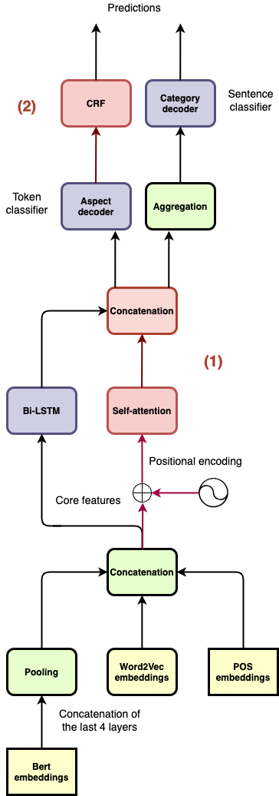

# Aspect-Based Sentiment Analysis

Aspect-Based Sentiment Analysis (ABSA) is a complex classification pipeline consisting of the following steps: aspect terms extraction (A), aspect polarities identification (B), category terms extraction (C), category polarities identification (D).

## Architecture details
We propose a multistep classifier to learn all the tasks in parallel in a *multitask-learning* fashion. Along these lines, we employ *linear* task-specific output heads to get the most from the shared latent representation of the input sentences.
For further insights, read the dedicated [report](https://github.com/LeonardoEmili/Aspect-Based-Sentiment-Analysis/blob/main/report.pdf) or the [presentation slides](https://github.com/LeonardoEmili/Aspect-Based-Sentiment-Analysis/blob/main/slides.pdf) (pages 7-14).

## Results
A benchmark showing the performance of the multistep classifier against individual learners. Please note that experiments with Φrestaurant refer to models trained only on data from the restaurant domain.

<table>
<tbody>
<tr class="odd">
<td style="text-align: left;" rowspan="2">Model</td>
<td style="text-align: center;" colspan="2">Aspects</td>
<td style="text-align: center;" colspan="2">Categories (<em>Φ</em><em>r</em><em>e</em><em>s</em><em>t</em><em>a</em><em>u</em><em>r</em><em>a</em><em>n</em><em>t</em>)</td>
</tr>
<tr class="even">
<td style="text-align: center;"><em>F</em>1<em>m</em><em>a</em><em>c</em><em>r</em><em>o</em></td>
<td style="text-align: center;"><em>F</em>1<em>m</em><em>i</em><em>c</em><em>r</em><em>o</em></td>
<td style="text-align: center;"><em>F</em>1<em>m</em><em>a</em><em>c</em><em>r</em><em>o</em></td>
<td style="text-align: center;"><em>F</em>1<em>m</em><em>i</em><em>c</em><em>r</em><em>o</em></td>
</tr>
<tr class="odd">
<td style="text-align: left;">Aspect classifier</td>
<td style="text-align: center;">41.25</td>
<td style="text-align: center;">60.16</td>
<td style="text-align: center;">-</td>
<td style="text-align: center;">-</td>
</tr>
<tr class="even">
<td style="text-align: left;">Category classifier</td>
<td style="text-align: center;">-</td>
<td style="text-align: center;">-</td>
<td style="text-align: center;">38.23</td>
<td style="text-align: center;">49.12</td>
</tr>
<tr class="odd">
<td style="text-align: left;">Multistep classifier</td>
<td style="text-align: center;"><strong>50.04</strong></td>
<td style="text-align: center;"><strong>65.02</strong></td>
<td style="text-align: center;"><strong>55.00</strong></td>
<td style="text-align: center;"><strong>66.47</strong></td>
</tr>
</tbody>
</table>

## Get the dataset
You may download the original dataset from [here](https://github.com/SapienzaNLP/nlp2021-hw2/tree/master/data). A preprocessed version of the dataset is available at `data/preprocessing/SemEval-2014.pth`.

## Implementation details

### Training
To speed up the training process, we freeze BERT embeddings and employ mixed-precision training. However, we suggest not using them if you notice a considerable drop in the performance.

### Using word-level BERT embeddings
To obtain word-level representations, we implement functions to efficiently compute Wordpiece masks as well as the scatter operation itself. However, its batched version is **slow**. For this reason, we highly encourage you to rely on ad-hoc solutions such as [pytorch-scatter](https://pytorch-scatter.readthedocs.io/) or to get inspired by AllenNLP's [approach](https://docs.allennlp.org/main/api/modules/token_embedders/pretrained_transformer_mismatched_embedder/).

## Test the model
For ready-to-go usage, simply run the notebook on Colab. In case you would like to test it on your local machine, please follow the [installation guide](https://github.com/SapienzaNLP/nlp2021-hw2#requirements).
